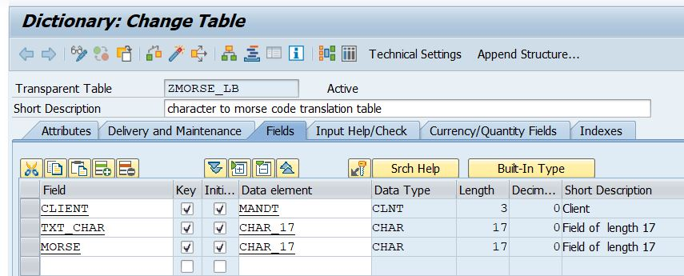
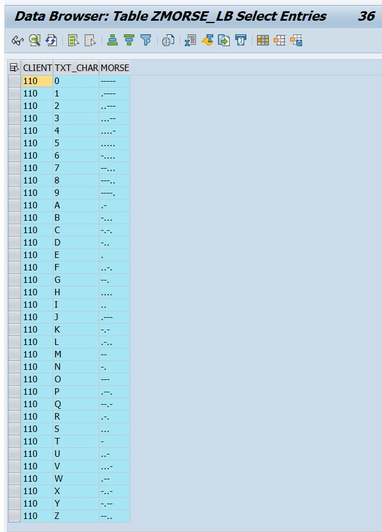
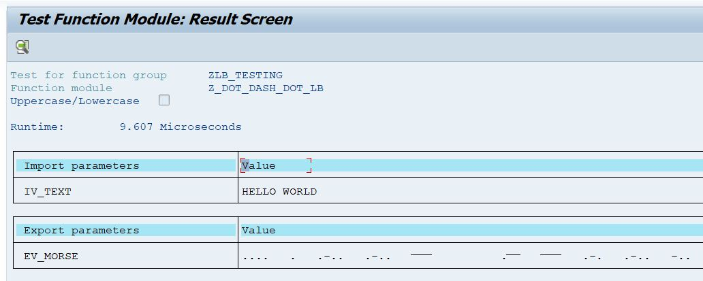

# Z_DOT_DASH_DOT_LB

[Z_DOT_DOT_DASH_LB.abap][1]

[1]: https://github.com/kubrickzirconia/odd-abap/tree/master/Z_DOT_DASH_DOT_LB/Z_DOT_DASH_DOT_LB.abap

This function module can be used to translate regular text into morse code. It works in the following steps:

1. For each character in importing string iv_text, find the character in ZMORSE_LB dictionary
2. Add corresponding morse string, retrieved from dictionary, to the ev_morse string
3. Export ev_morse as the result

It is standard for morse code to contain space between letters of equivialent 3 dots, and space between words equivialent 7 dots. This has been achieved in this function module.

## Data Dictionary

A bespoke data dictionary was created for this project, with the following structure:

| Field | Key | Initialize | Data element |
| ----- | --- | ---------- | ------------ |
| CLIENT | X | X | MANDT |
| TXT_CHAR | X | X | CHAR_17 |
| MORSE | X | X | CHAR_17 |

Your data dictionary should look like this:

Each alphanumeric character is represented as a pair, with the regular character stored in the TXT_CHAR field and the morse code equivalent stored in the MORSE field.

This dictionary needs to be populated with morse code translations for all alphanumeric characters. To do this, generate a table maintenance log for the table. Then, fill in the contents directly using transaction SM30. You can copy the values from the table below.

| TXT_CHAR | MORSE |
| --------- | ----- |
| 0 | ----- |
| 1 | .---- |
| 2 | ..--- |
| 3 | ...-- |
| 4 | ....- |
| 5 | .... |
| 6 | -.... |
| 7 | --... |
| 8 | ---.. |
| 9 | ----. |
| A | .- |
| B | -... |
| C | -.-. |
| D | -.. |
| E | . |
| F | ..-. |
| G | --. |
| H | .... |
| I | .. |
| J | .--- |
| K | .-.. |
| L | .-.. |
| M | -- |
| N | -. |
| O | --- |
| P | .--. |
| Q | --.- |
| R | .-. |
| S | ... |
| T | - |
| U | ..- |
| V | ...- |
| W | .-- |
| X | -..- |
| Y | -.-- |
| Z | --.. |

The dictionary contents should look like this:

## Function Module

For this project, a new function module was created in SE37. The function module uses two parameters:

* Importing Parameter: IV_TEXT TYPE STRING
* Exporting Parameter: EV_MORSE TYPE STRING

The user fills the importing parameter with the text they would like to translate, at the function module returns the morse code translation in the exporting parameter.

See below for an example of the input/output of the function module:

