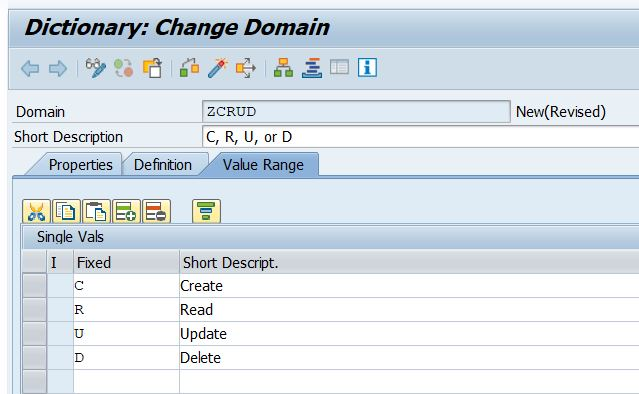
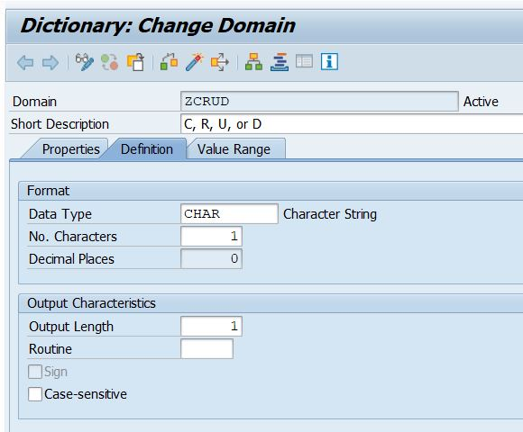

# Z_PLAYLIST_LB

This project consists of two main components:

1. ZTRACKS_LB: a DDIC to store a list of songs.

2. Z_PLAYLSIT_LB: an RFC enabled function module that can be used to create, read, update, and delete ZTRACKSLB. 

## Data Dictionary

ZTRACKS_LB can be created in SE11. The image below shows the fields I included in my custom DDIC. I chose to create my own custom data elements and domains for each field.

## RFC Enabled Function Module

Can be called externally, like an API.

#### The Parameters

A second DDIC structure was created for the importing table parameter as the table needed to include a field for the CRUD operations. 

For the CRUD field, a custom domain and data element, both named ZCRUD, were created:

 

#### The Sourcecode 

## Using Z_PLAYLIST_LB
