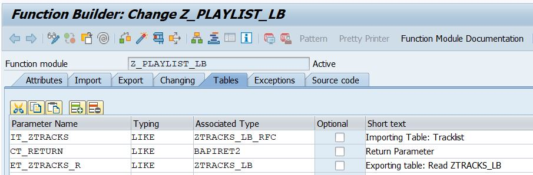

# Z_PLAYLIST_LB

[Z_PLAYLIST_LB.abap][1]

[1]: https://github.com/kubrickzirconia/odd-abap/tree/master/Z_PLAYLIST_LB/Z_PLAYLIST_LB.abap

This project consists of two main components:

1. ZTRACKS_LB: a DDIC to store a list of songs.

2. Z_PLAYLSIT_LB: an RFC enabled function module that can be used to create, read, update, and delete fields from ZTRACKSLB. 

The Z_PLAYLIST_LB function module can be used to perform the CRUD operations on the database, allowing the user to maintain a tracklist. The user supplies any data they wish to create, update, or delete, as well as one of the CRUD letters. The function module enacts the CRUD operation and peforms any database commits. The user receives any error messages and, if they requested the Read operation, the user receives a list of all entries in ZTRACKS_lB as a table.

A flaw in this program is that each execution can only handle one CRUD operation. For isntance, in the same run, you cannot update some entries and delete others. The program will take the CRUD operation of the first line and perform that operation for all given entries.

## Data Dictionary

ZTRACKS_LB can be created in SE11. The image below shows the fields I included in my custom DDIC. I chose to create my own custom data elements and domains for each field.

## RFC Enabled Function Module

The function module Z_PLAYLIST_LB was created in SE37, and assigned to a function group created specifically for this project. On the attributes tab, the Processing Type must be set to 'Remote-Enabled Module'. This ensures that the function module can be called externally, like an API.

### The Parameters

__IT_ZTRACKS__

This table acts as the import to the function module. The user inputs however many lines of data, with the corresponding CRUD operation. 

A second DDIC structure was created for the importing table parameter as the table needed to include a field for the CRUD operation. 

For the CRUD field, a custom domain and data element, both named ZCRUD, were created to define a specific value range of C, R, U, or D. Besides the additional field added, this structure is the same as the structure for ZTRACKS_LB.

__CT_RETURN__

Any error messages triggered are added to this table, so that the user can see which entries were unsuccessful.

__ET_ZTRACKS_R__

This table has the same structure as ZTRACKS_LB. If the user requests the 'R' operation, this table is populated with all of the entries in ZTRACKS_LB, so that the user can view the contents of the dictionary.

### Error Handling

I created a message class in SE91, which will be used to populate any error messages to CT_RETURN, the return parameter for the function module.

A subroutine, ERROR_MESSAGE, can be found at the bottom of the function module. This subroutine handles adding error messages to CT_RETURN. It is performed at any point where an error occurs. The subroutine could be copied to an include and placed at the top of the program if desired.
