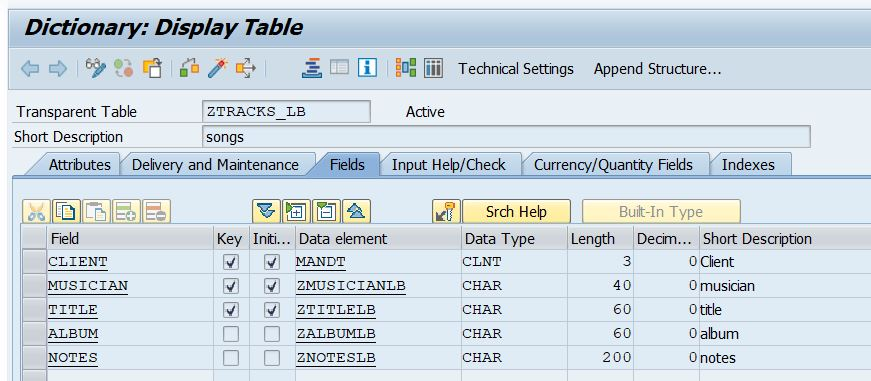
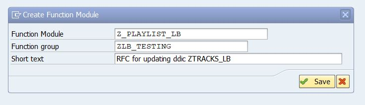
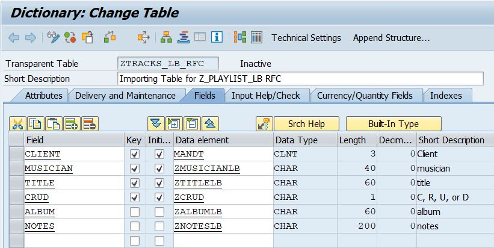
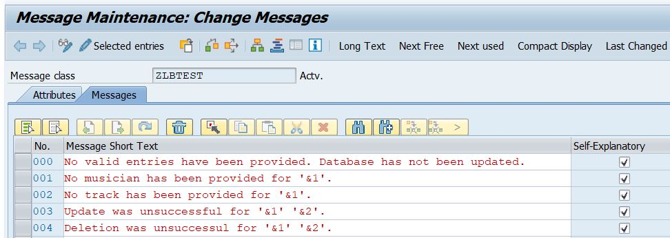

# Z_PLAYLIST_LB

This project consists of two main components:

1. ZTRACKS_LB: a DDIC to store a list of songs.

2. Z_PLAYLSIT_LB: an RFC enabled function module that can be used to create, read, update, and delete fields from ZTRACKSLB. 

The Z_PLAYLIST_LB function module can be used to perform the CRUD operations on the database, allowing the user to maintain a tracklist. The user supplies any data they wish to create, update, or delete, as well as one of the CRUD letters. The function module enacts the CRUD operation and peforms any database commits. The user receives any error messages and, if they requested the Read operation, the user receives a list of all entries in ZTRACKS_lB as a table.

## Data Dictionary

ZTRACKS_LB can be created in SE11. The image below shows the fields I included in my custom DDIC. I chose to create my own custom data elements and domains for each field.

## RFC Enabled Function Module

The function module Z_PLAYLIST_LB was created in SE37, and assigned to a function group created specifically for this project. On the attributes tab, the Processing Type must be set to 'Remote-Enabled Module'. This ensures that the function module can be called externally, like an API.

### The Parameters

A second DDIC structure was created for the importing table parameter as the table needed to include a field for the CRUD operations. 

For the CRUD field, a custom domain and data element, both named ZCRUD, were created to define a specific value range of C, R, U, or D.

### Error Handling

I created a message class, which will be used to populate any error messages to CT_RETURN, the return parameter for the function module.

