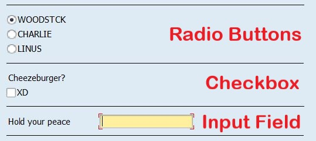

# Z_PRESSSTART_LB

Uploaded 03/04/2019

1. Enter transacton code SE38.
2. Enter program name, select Source Code radio button, click the Create button.
3. Fill in the Program Attributes according to your own requirements.
4. Copy and paste the code contained in _Z_PRESSSTART_LB.abap_ into your new program.

The file _winning.gif_ provides an example of the gameplay and reveals the solution to the puzzle.

## Selection Screens in SAP

Press Start works using selection screens, a vital component of SAP executable report programs, usually used to retreive or edit data from the DBMS. A standard SAP selection screen is created so that the player can create a filtered search/update query and execute it. The selection screen elements are used to facilitate these selections. Press Start uses three types of selection screen elements, illustrated below:

For Press Start, pressing execute reveals whether the player has solved the puzzle. If they have, a winner message is displayed. If they have not, a loser message is displayed.

## Solution: Understanding the Game

Press Start is a cryptic puzzle. The user is given 10 clues and 10 questions to answer. Please see below for an explanation of the puzzle's cryptic clues. The following also includes the puzzle's solution. 

### The 10 Clues

The player is presented with ten clues to help them solve the puzzle; however, upon reading them, it is clear that the clues contradict each other. 

The key to working out which clues are fake is to look for two clues that reinforce each other. Number 5 and number 7 reinforce one another. Together, they are two alternating statements that are true (as clue 5 claims) and, as clue 7 claims, clue number 5 is true.

> 1. Every item has a pair
> 2. You cannot win this game
> 3. Leave but one thing blank
> 4. Leave nothing blank
> 5. **Every other statement is a lie**
> 6. The statement above is a lie
> 7. **Statement number 5 is true**
> 8. I’m loving it
> 9. Whereof one cannot speak...
> 10. What does the fox say?

Once the player has worked this out, they can cross out each even clue, leaving them with the following list of helpful clues:

> 1. Every item has a pair
> 2. ~~You cannot win this game~~
> 3. Leave but one thing blank
> 4. ~~Leave nothing blank~~
> 5. Every other statement is a lie
> 6. ~~The statement above is a lie~~
>7. Statement number 5 is true
> 8. ~~I’m loving it~~
> 9. Whereof one cannot speak...
> 10. ~~What does the fox say?~~

### Answering the Questions

As clue number 1 states, every item in the puzzle has a pair. So, the player needs to answer the questions in such a way that there are 5 pairs of answers. 

The game is difficult precisely because they are so many red herrings - so many different ways to interpret the questions put forward. Although there are many different interpretations, there is only one set of correct answers. Generally, the answers are linguistic puns that play with well known sayings and memes. The following explains the solution to the game: 

**I can has cheezburger?**

CAT' pairs with 'Cheezeburger?'

These two questions reference the popular meme 'I can has cheezburger?'. Check the cheezeburger checkbox so that the cat can has cheezburger. 

**How much wood would a woodchuck chuck?**

'WOODSTOCK' pairs with 'CHUCKIE'

Mashing the words Woodstock and Chuckie together creates the word woodchuck, a reference to the 'how much wood...' tongue twister

**Lochness Monster**

'Open Me' pairs with 'NESS'

The answer to 'Open Me' is 'LOCK' because, although you use a key to open things, the thing that you open is a lock. Pairing Lock (Loch) and Ness creates the word "lochness". 

**The Communist Manifesto**

'HAMMER' pairs with 'SICK'

Hammer & Sick evokes the Hammer & Sickle, the famous symbol of 20th century communist revolution.

**The Sound of Silence**

'Hold Your Peace' pairs with 'ASL'

Clue number 3 reveals that one of the answers should be left blank. 

ASL (age/sex/location) is internet slang commonly used by _single_ people when getting to know one another. This means that in this pair there is a single answer. Hold Your Peace should be left blank - speak now or forever hold your peace - the player stays silent, holding their peace.

